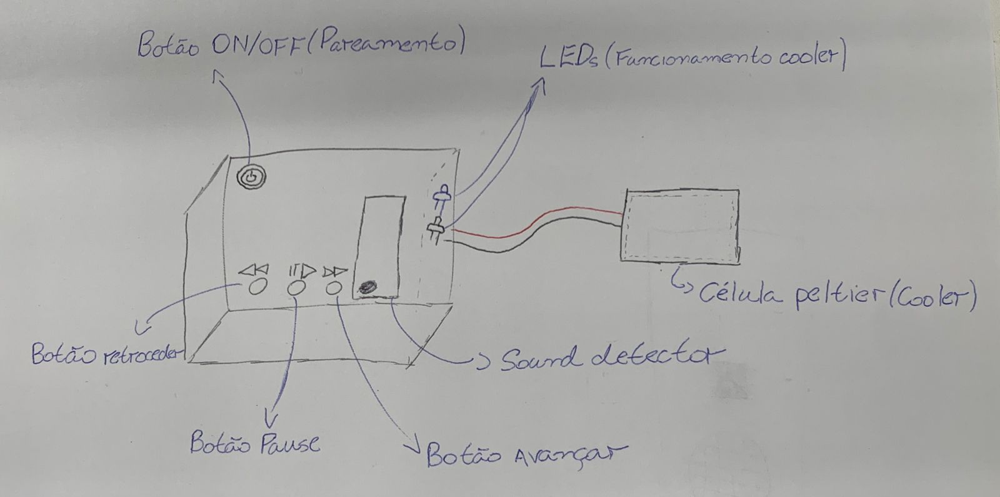
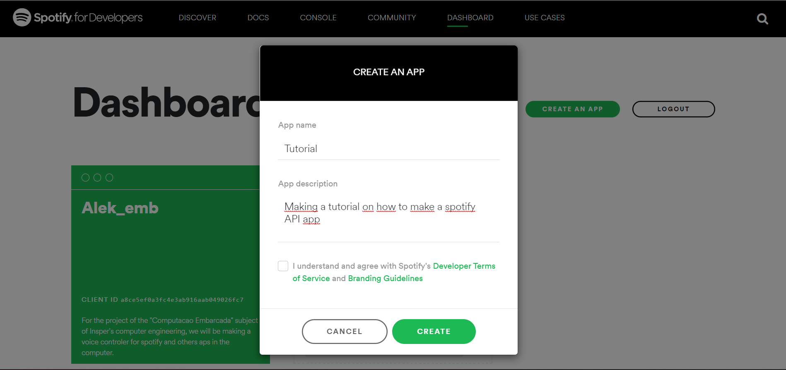
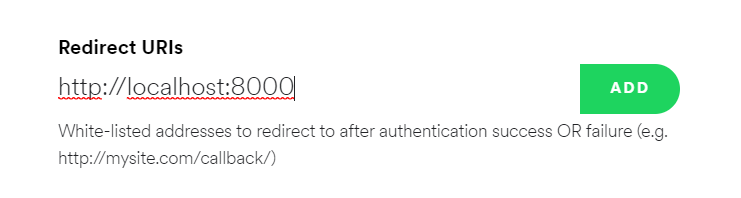
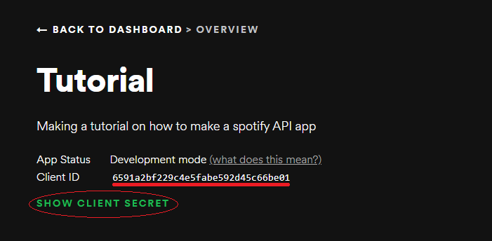

# Projeto Embarcados: Alek

Desenvolvendo um controle por voz para o computador!

## Entrega 1

### Integrantes

- Guilherme Fontana Louro
- Ricardo Ribeiro Rodrigues

### Ideia

Protótipo de interface física com
assistente virtual, capaz de tocar músicas no spotify e 
controlar certas saídas digitais físicas.


### Nome

**Alek**

### Usuários 

Donos de computador que gostariam de controlar seu computador (ênfase no spotify) por voz.

### Software/Jogo 

**Spotify** e **navegador**.

### Jornada do usuários (3 pts)


Jornada 1:      
O usuário liga o "alek" utilizando o botão de liga/desliga, após isso, ele utiliza o reconhecimento de voz para solicitar que uma música seja tocada no serviço spotify. 
A música é tocada e o usuário resolve pausar a reprodução utilizando o botão de pause/play.
Após isso, ele despausa a música utilizando o mesmo botão e avança para outra usando o botão de avançar música.

Jornada 2:       
O usuário liga o "alek" utilizando o botão de liga/desliga, após isso, ele utiliza o reconhecimento de voz para solicitar o "modo final de semana".
Com esse comando, sua playlist favorita começa a tocar no serviço spotify no modo aleatório. 
Além disso, é aberto no browser do computador o site "blacktag.com" na aba de festas e finalmente é utilizado a célula peltier para iniciar o resfriamento da sua bebida ( de preferência uma cerveja).
Enquanto isso, os leds indicam que o sistema de controle da temperatura está funcional.

### Comandos/ Feedbacks (2 pts)
**Comandos**:
- **Botão power**: liga o dispositivo e pareia no bluetooth.      
- **Microfone**: Entrada para os diversos comandos de voz do dispositivo, onde o usuário poderá colocar playlists no spotify e até mesmo gelar bebidas com comandos de voz.       
- **Botões coloridos(3)**: Estes botões controlarão o spotify em aspectos que o comando de voz não é tão conveniente, como passar e voltar de música e pause/play.

**Feedbacks**:
- O botão power da feedback para o usuário sobre o pareamento com as luzes presentes nele, ele ficará piscando até que o pareamento seja concluído.
- O Led dá feedback sobre o funcionamento do sistema de cooling de bebida, ligando quando o relê estiver ligado, e desligando quando estiver desligado.


#### Lista de commandos: 
- "Alek, Modo fim de semana": Liga Led, toca a playlist e ativa o rele na placa.
- "Alek, Proxima musica": Toca a proxima musica da playlist.
- "Alek, volta": Toca a musica anterior da playlist.
- "Alek, Pausa": Pausa a musica.
- "Alek, toca" Ou "Alek, play": Toca a atual na fila do spotify.
- "Alek, Desliga": Desliga o rele e led na placa e a musica.

## In/OUT (3 pts)

**In**:
1) **Sound detector**: Controle de músicas por voz do spotify, da célula de peltier, do led e possivelmente outros aplicativos;
2) **Botão** de ligar/desligar (power);
3) **Botão** de pause/play da música;
4) **Botão** de avançar música;
5) **Botão** de gravar o áudio;
6) **Botão** de retroceder música.      

**Out**:
1) **Relê** Para o acionamento de um frigobar ou semelhante; 
2) **Led** para indicar funcionamento do sistema de controle de temperatura.

### Design (2 pts)

  

### Tutorial spotify:

1. Entre [nesse link](https://developer.spotify.com/dashboard/) e faça login com sua conta.

2. Clique em "create an app".


3. Em seguida, no dashboard do seu app, clique em "EDIT SETTINGS".

4. Adicione em "Redirect URI's" o caminho: "http://localhost:8000" e clique em add, como mostrado na imagem a seguir:


5. Em seguida, monte um .env no caminho "22b-emb-proj-alek/python/lib/.env", com a seguinte estrutura:
```
export SPOTIPY_CLIENT_ID='SUA CLIENT ID'
export SPOTIPY_CLIENT_SECRET='SEU CLIENT SECRET'
export SPOTIPY_REDIRECT_URI='http://localhost:8000'
```

Estes dados se localizam no inicio do dashboard do seu projeto:


Para ver o client secret, basta clicar no show client secret.

